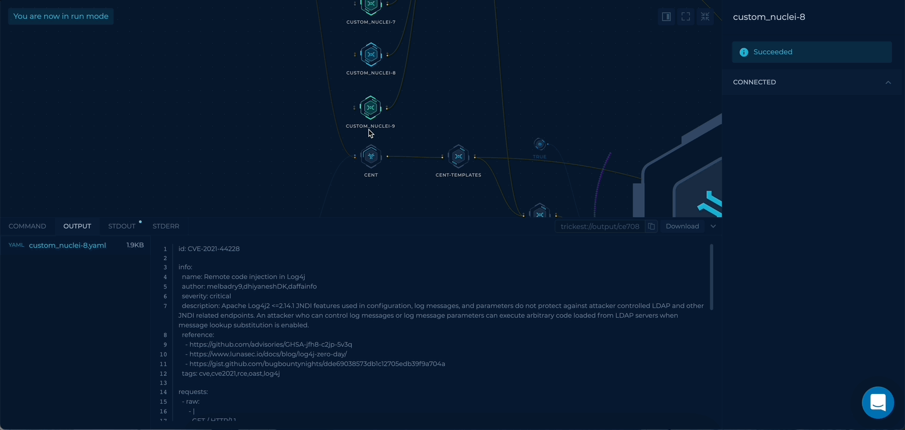

# Trickest Log4j
Several versions of Apache Log4j are vulnerable to remote code execution (RCE). Many bypasses and payloads have been published; this repository aims to provide a solution that allows security teams to use all of this knowledge effectively.

## Motivation
With all the research done on Log4j every day, we found it essential to create a consistent process that can:
- incorporate all of the techniques that were published and proven to be effective
- scale across thousands of assets
- integrate discovery techniques as quickly as they are found

So We designed a [Trickest](https://trickest.com) workflow.

## How it works
[Trickest](https://trickest.com) Workflow used:



### TB; DZ (Too big; didn't zoom):
- Get a list of payloads from this repository's `payloads` folder
- Add some control characters that we found helpful while bypassing WAFs to each payload.
- Use an [interactsh](https://github.com/projectdiscovery/interactsh) client to generate a callback URL. (Thanks [ProjectDiscovery](https://github.com/projectdiscovery)!)
- Use [unfurl](https://github.com/tomnomnom/unfurl) to insert the callback URL with a custom endpoint into each payload - this will help us correlate each hit to a target and an attack technique (Thanks [tomnomnom](https://github.com/tomnomnom)!)
- Use [Hydra](https://github.com/vanhauser-thc/thc-hydra) to send the payloads to all targets across different services.
- Use [cent](https://github.com/xm1k3/cent) to collect community nuclei templates (Thanks [xm1k3](https://github.com/xm1k3)!).
- Use a few custom and community [nuclei](https://github.com/projectdiscovery/nuclei) templates to test using different techniques ([ProjectDiscovery](https://github.com/projectdiscovery)!, thanks again!)
- Use an [interactsh](https://github.com/projectdiscovery/interactsh) client to poll the URL and get a list of vulnerable hosts (Seriously @ProjectDiscovery, thank you!)
- Generate the final report that contains all the results.

## How to Update
The workflow uses this repository as a source (soon! [issue #2](https://github.com/trickest/log4j/issues/2)), so any attack payloads added to this repository will be picked up and used automatically. Check out the [issues](https://github.com/trickest/log4j/issues) for a list of ideas that will be implemented in future versions of the workflow. [README.md](http://README.md) will be updated accordingly.

To update the techniques used, you can either:
- Add string payloads to the ```payloads``` folder.
- Add nuclei templates to the ```custom``` folder.

## Resources
- [thchydra](https://github.com/vanhauser-thc/thc-hydra)
- [unfurl](https://github.com/tomnomnom/unfurl)
- [cent](https://github.com/xm1k3/cent)
- [nuclei](https://github.com/projectdiscovery/nuclei)
- [nuclei-templates](https://github.com/projectdiscovery/nuclei-templates)